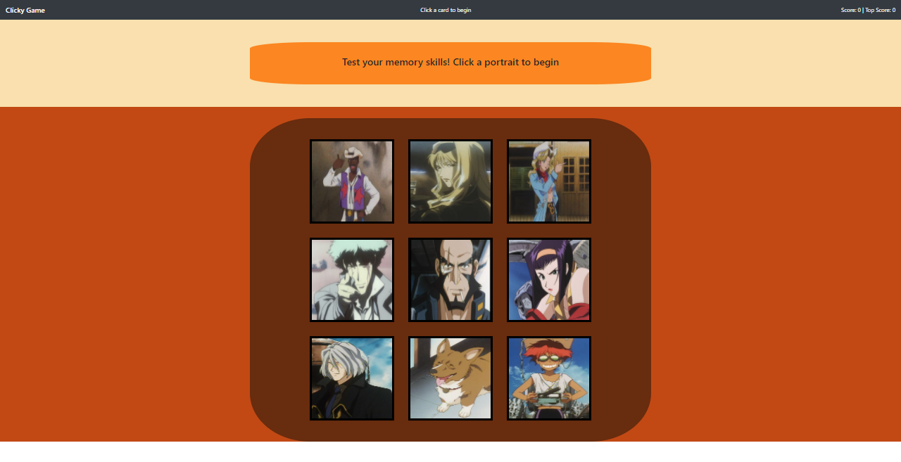

# Clicky

----------------------

## Table of Contents

[Description](#Description) |
[Deployed Link](#Deployed-Link) |
[Prerequisites](#Prerequisites) |
[Technologies](#Technologies-Used) |
[Website Image](#Website-Image) |
[Code Snippet](#Code-Snippet) |
[Authors](#Authors) |
[License](#License) |
[Acknowledgements](#Acknowledgements) |

## Description

Application is a memory game that allows users to select cards. Upon selecting a previously selected card, the users score will reset to 0 and the game will reset.


## Deployed Link

...

## Prerequisites

None

## Technologies Used

- Javascript
- CSS
- JSX
- React

## Website Image



## Code Snippet

Showcased is the conditional statement that allows the application to update the current states and reset if the condition is met.

```Javascript
selected = (key) => {
    this.shuffle();

    if (this.state.selected.indexOf(key) !== -1) {
        this.setState({
            score: 0,
            selected: [],
            message: "You're gonna carry that weight..."
        });
    } else {
        this.state.selected.push(key);

        this.setState({
            score: this.state.score + 1,
            message: "Bang! Keep going"
        })
    }
```

## Authors

1. **William W. Bryan**

- [Github](https://github.com/WeiLiBryan)
- [LinkedIn](https://www.linkedin.com/in/william-bryan-72730019a/)

## License

[](https://opensource.org/licenses/MIT)

## Acknowledgements

- [Stack Overflow](https://stackoverflow.com)
- [w3schools](https://w3schools.com)

### [Back to Table of Contents](#table-of-contents)